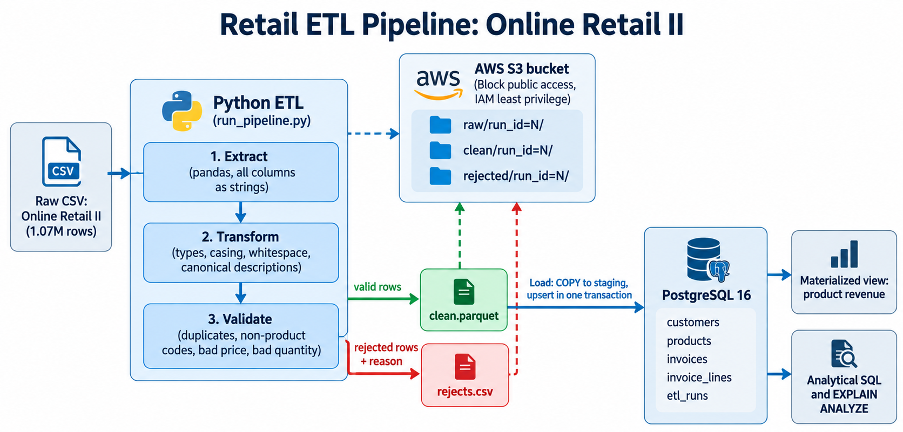

# Retail ETL Pipeline

This is my submission for the Associate Data Engineer technical exam. It's a Python ETL pipeline built around the Online Retail II dataset (about 1.07 million transaction rows from a UK online gift retailer). It extracts the raw CSV, cleans and validates it, logs every rejected row with a reason, loads everything into a normalized PostgreSQL database, and backs up raw/clean/rejected data to S3. I also did some SQL performance tuning with indexes and a materialized view, and wrote up how I'd scale this past a million rows.

## Stack
Python 3.11 (pandas, psycopg2, boto3, pyarrow, pytest), PostgreSQL 16 in Docker, AWS S3 + IAM, Docker Compose.

## How it's laid out

A raw CSV goes in. Python extracts it, standardizes the types and text, then validates it — valid rows go one way, invalid rows go the other way with a reason attached. Both, plus the original raw file, get uploaded to S3. The clean data gets loaded into Postgres. From there I refresh a materialized view and run some analytical queries against it.


I also drew a proper diagram.


Every run gets a `run_id`, logged in an `etl_runs` table and reused as the S3 key prefix, so I can trace any uploaded file back to the exact run that produced it.

## Project structure
```
retail-etl/
├── run_pipeline.py          # entry point, run this
├── docker-compose.yml       # spins up Postgres with the schema pre-applied
├── requirements.txt
├── .env.example
├── config/settings.py
├── etl/
│   ├── extract.py
│   ├── transform.py
│   ├── validate.py
│   ├── load.py
│   └── s3_utils.py
├── sql/
│   ├── 01_schema.sql
│   ├── 02_indexes.sql
│   ├── 03_analytics.sql
│   ├── 04_benchmark.sql
│   └── ...                  # smaller experiments I ran along the way
├── tests/test_transform.py
├── eda.py
├── smoke.py
└── docs/
```

## Getting it running

You'll need Python 3.11+, Docker Desktop, and (if you want to test the S3 part) an AWS account.

```bash
git clone <this-repo> && cd retail-etl
python -m venv .venv
# Windows: .venv\Scripts\Activate.ps1   |   Mac/Linux: source .venv/bin/activate
pip install -r requirements.txt
cp .env.example .env   # fill in your own values
```

Grab the dataset from Kaggle — [Online Retail II UCI](https://www.kaggle.com/datasets/mashlyn/online-retail-ii-uci) — and drop the CSV at `data/raw/online_retail_II.csv`.

```bash
docker compose up -d          # starts Postgres, applies the schema automatically
python run_pipeline.py        # full run
```

Useful flags:
- `--sample 50000` — only process the first N rows, good for quick testing
- `--skip-s3` — skip AWS entirely, no credentials needed
- `--skip-raw-upload` — still upload the clean/rejected files but skip the big raw CSV (mine is slow to upload on my connection)

To wipe the database and start over: `docker compose down -v` then `docker compose up -d`.

### .env values
| Variable | What it's for |
|---|---|
| `POSTGRES_HOST/PORT/DB/USER/PASSWORD` | connects to the Postgres container |
| `AWS_ACCESS_KEY_ID` / `AWS_SECRET_ACCESS_KEY` | credentials for a dedicated, locked-down IAM user |
| `AWS_DEFAULT_REGION` | `ap-south-1` for me |
| `S3_BUCKET` | your bucket name |

Nothing's hardcoded — `.env` is git-ignored and everything reads from environment variables.

### What a full run looks like
```
EXTRACT  rows read: 1067371 (36.8s)
TRANSFORM standardized (45.9s)
VALIDATE clean: 1021334 | rejected: 46037
   reject reason duplicate            34337
   reject reason non_product_code     5713
   reject reason bad_quantity         3393
   reject reason bad_price            2594
etl.load | Inserted 1021334 new invoice lines
etl.load | Refreshed materialized view mv_product_revenue
DONE run 1 | read 1067371 = clean 1021334 + rejected 46037 | loaded 1021334 | 140.2s
```
Final table counts: 5,875 customers, 4,747 products, 46,926 invoices, 1,021,334 invoice lines — matches the load exactly. If I run it again on the same file, it inserts 0 new rows, which is the idempotency I was going for.

## Why the dataset is messy (and what I found)

Before writing any cleaning rules I profiled the raw data with `eda.py` (full output in `docs/eda_output.txt`), because I wanted the rules to come from what was actually in the data, not guesses.

- 22.77% of rows have no `Customer ID` — these are guest checkouts
- 0.41% missing `Description`
- 34,335 exact duplicate rows
- 19,494 rows belong to cancellation invoices (they start with "C")
- 3,457 rows have negative quantity outside of a cancellation
- 6,207 rows have a price of zero or less
- A handful of stock codes aren't real products at all — `POST`, `DOT`, `M`, `BANK CHARGES`, `ADJUST`, `AMAZONFEE`, and a few others
- 1,232 stock codes have more than one description floating around (typos, revisions)
- I checked two assumptions my schema depends on: no invoice spans more than one country or more than one customer — both held (0 exceptions). 83 invoices did have two different timestamps though, so I take the earliest one.

## How I clean and validate it

Everything gets read in as plain strings first, so nothing gets silently type-cast into something wrong. Then in `transform.py`:

- Whitespace gets trimmed, empty strings become actual nulls
- Stock codes get uppercased, descriptions uppercased with extra spaces collapsed, countries title-cased
- Quantity, price, date and customer ID get parsed properly, with anything unparseable turning into a null instead of crashing
- Cancellations get flagged based on the "C" prefix on the invoice number
- For stock codes with conflicting descriptions, I pick whichever one shows up most often

Then `validate.py` runs a set of ordered rules, and whichever rule a row hits first becomes its `reject_reason`:

- Duplicate (same invoice, stock code, quantity, date, price, customer)
- Missing invoice number, date, or stock code
- Non-product stock code
- Bad quantity (null, zero, or negative on something that isn't a cancellation)
- Bad price (null or ≤ 0)

A couple of decisions I made on purpose:
- **I kept cancellations instead of rejecting them.** They're real business events, not bad data.
- **I kept guest checkouts (null customer ID) instead of dropping them.** That's 23% of the dataset — dropping it would have thrown away a lot of legitimate sales.
- **Rejected rows aren't just discarded** — they go to `data/rejected/rejects.csv` (and up to S3) with the reason attached, so nothing disappears silently. The counts always add up: `read = clean + rejected`.

## The database

```
customers(customer_id PK)
products(stock_code PK, description)
invoices(invoice_no PK, customer_id FK nullable, invoice_date, country, is_cancellation)
invoice_lines(PK (invoice_no, line_no), stock_code FK, quantity, unit_price, line_total)
etl_runs(run_id PK, started_at, finished_at, rows_read, rows_rejected, rows_loaded, status)
```

Primary keys everywhere, foreign keys for integrity, and check constraints (`unit_price > 0`, `quantity <> 0`) so bad data can't sneak in even if my Python code has a bug somewhere. `invoice_lines` uses a composite natural key `(invoice_no, line_no)` specifically so I can make loads idempotent.

## Loading it in

I load through a staging table rather than inserting row by row:

1. `COPY` the cleaned data into a temp staging table — this is much faster than individual `INSERT`s
2. In one transaction, upsert from staging into `customers` → `products` → `invoices` → `invoice_lines`, using `ON CONFLICT DO NOTHING` so reruns don't duplicate anything
3. If anything goes wrong, the whole transaction rolls back — I never end up with a half-loaded database
4. Refresh the materialized view once loading is done

A full load takes about 78-140 seconds depending on the run. Running it a second time on the same file inserts 0 rows.

## Query performance

My analytical queries live in `sql/03_analytics.sql`: top 10 products by revenue, monthly revenue with month-over-month growth (using `LAG()`), average order value by country, and a customer's order history. Revenue always excludes cancellations.

I benchmarked with `EXPLAIN (ANALYZE, BUFFERS)` before and after adding indexes (raw outputs in `docs/`). Here's what I found:

| Query | No indexes | Indexed + tuned | What happened |
|---|---|---|---|
| Top 10 products by revenue | ~934 ms | ~930-1040 ms | Basically unchanged — this query touches most of the table, so an index can't help |
| Same query, via materialized view | n/a | **~0.22 ms** | Pre-aggregating the data instead of indexing it |
| Avg order value, one month | ~339 ms | ~224-273 ms | Index gets used on `invoices`, but the join against `invoice_lines` still dominates |
| One customer's order history | ~205 ms | **~15 ms** | Planner switched to using the index once tuned for SSD, about 13x faster |
| Product lookup by stock code | ~86 ms | **~10.4 ms** | Sequential scan → bitmap index scan, about 8x |

The most interesting part wasn't the wins, it was figuring out why one of my indexes wasn't being used at all. I'd created an index on `customer_id`, confirmed it existed, and the planner still ran a full table scan. Turns out Postgres defaults to assuming disks are slow to seek randomly (`random_page_cost = 4`), which made it think scanning was cheaper than jumping around with an index — true on spinning disks, not true on the SSD my Docker container runs on. I set `random_page_cost = 1.1` in `docker-compose.yml` and the planner switched to using the index, dropping that query from ~160ms to ~15ms.

And for the top-products query, no index helped no matter what I did, because it needs to read almost the whole table — an index only pays off when you're skipping most of the data, not most of it. So instead I built a materialized view (`mv_product_revenue`) that pre-computes the aggregation, and refresh it at the end of every pipeline run. The tradeoff is the numbers are only as fresh as the last run, which felt like a fair one to make here.

## S3

Each run uploads to three prefixes, tagged by run ID:
```
s3://<bucket>/raw/run_id=<n>/online_retail_II.csv.gz
s3://<bucket>/clean/run_id=<n>/clean.parquet
s3://<bucket>/rejected/run_id=<n>/rejects.csv
```

I set this up with least privilege in mind rather than just using my root account:
- A dedicated IAM user (`retail-etl-pipeline`) with no console access, attached to a policy that only allows `ListBucket` on this one bucket and `PutObject`/`GetObject`/`AbortMultipartUpload` scoped to these three prefixes (`docs/iam_policy.json`). No delete permission, no access to anything else.
- Credentials come from environment variables loaded from `.env`, never hardcoded, never committed.
- Public access is blocked on the bucket, default encryption is on.
- I gzip the raw file before uploading and tuned the retry/concurrency settings, since my first attempt actually dropped mid-upload — turned out to be a flaky connection issue, not an AWS problem, since the credentials and IAM policy were clearly fine (it got through 4 parts before dying).
- There's a lifecycle rule that cleans up any abandoned multipart uploads after a day.

## If this had to handle way more data

The current setup handles 1M rows fine in under 3 minutes, but here's how I'd think about scaling it further:

**Processing** — I'd process in chunks instead of loading the whole file into memory, and past maybe 10 million rows I'd move the transform step off pandas entirely and onto something like Spark or AWS Glue, reading partitioned Parquet straight from S3.

**Scheduling** — for something simple, cron or an EventBridge rule kicking off the script nightly would be fine. For anything more serious I'd want an actual Airflow DAG: upload → transform/validate → load → refresh views → quality checks, each with retries and alerting if something fails.

**Partitioning/indexing** — I'd range-partition the big fact table by month so queries only touch relevant partitions, use BRIN indexes on the date columns since this data is append-only, and swap the full materialized view refresh for something incremental.

**Handling failures** — the loads are already transactional and idempotent, so a rerun after a crash is safe. Every run gets logged in `etl_runs` with its status, raw data stays in S3 so I can always replay a run, and bad rows go to a reject log instead of stopping the whole pipeline. At scale I'd add retry logic for transient errors and maybe a dead-letter spot for rows that keep failing.

## Testing
```
python -m pytest -q
```
5 tests covering the transform logic (casing, whitespace, cancellation handling) and the validation rules (duplicates, bad price, non-product codes, guest checkouts kept). Beyond the unit tests, the row counts reconciling exactly (`read = clean + rejected`, loaded = final table count) and the idempotent rerun are really what convinced me the pipeline was correct end to end.

## A few honest caveats
- "Revenue" throughout excludes cancelled orders — a true net-revenue number would need to subtract those back out
- The line numbers I generate come from the order rows appear in the file, so a rerun assumes the same input file
- My list of "non-product" stock codes came from eyeballing the profiling output — a new one showing up later would need adding by hand
- Everything runs single-process in pandas right now, which is fine at 1M rows but wouldn't hold up much past that without the changes above
- The benchmark numbers are single runs on my own laptop, so treat them as indicative rather than rigorous